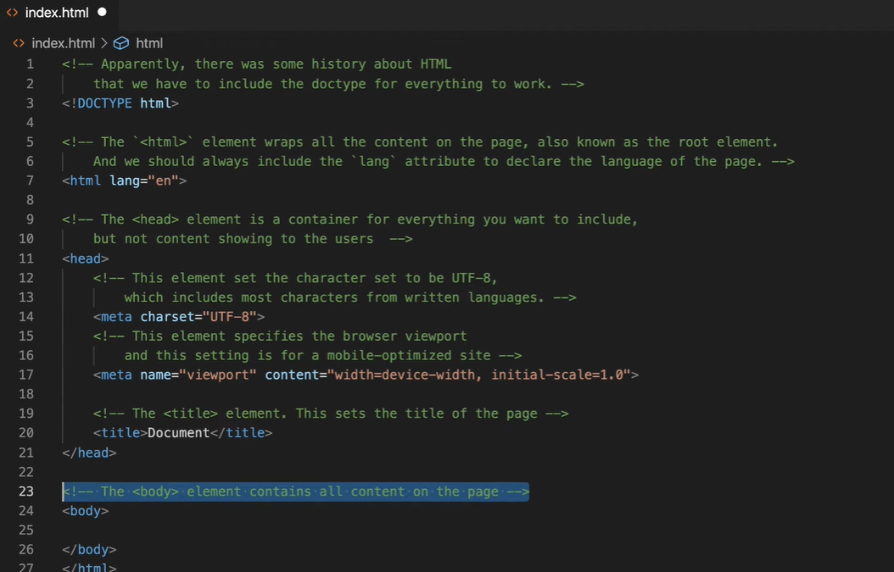

# HTML - Hypertext Markup Language

[YouTube](https://youtu.be/HTjvQpZ5J0k)

**What is HTML?**
- HTML stands for Hyper Text Markup Language
- HTML is the standard markup language for creating Web pages
- HTML describes the structure of a Web page
- HTML consists of a series of elements
- HTML elements tell the browser how to display the content
- HTML elements label pieces of content such as "this is a heading", "this is a     paragraph", "this is a link", etc.

## HTML page

```
<!DOCTYPE html>
<html>
<head>
<title>Page Title</title>
</head>
<body>

<h1>This is a Heading</h1>
<p>This is a paragraph.</p>
<ul>
<li>One</li>
<li>Two</li>
<li>Three</li>
</ul>

<ol>
<li>One</li>
<li>Two</li>
<li>Three</li>
</ol>


<a href="link">Home</a>

<hr />

<br />


</body>
</html>

```


## Empty Element
Insert or Embed something in the document
`<input>, , <br>, <hr>, <embed>, <meta>, <link>`

## Nesting
HTML elements can be nested

```
    <div class="list">
    <h2>My List: </h2>
    <ul>
        <li>Apple</li>
        <li>Mango</li>
        <li>Banana</li>
    </ul>
    </div>

```

## Attributes

Attributes contain extra information about the element that won't appear in the content

`  `

- All HTML elements can have attributes
- Attributes provide additional information about elements
- Attributes are always specified in the start tag
- Attributes usually come in name/value pairs like: name="value"

## Boolean Attributes
- some attributes can be written without value eg. disabled is boolean attributes
` <button onclick="alert("button clicked") disabled="disabled">Button Click</button> `
` <button onclick="alert("button clicked") disabled >Button Click</button> `

## Most common HTML Elements
There are hundreds of HTML elements, most of the time we only use these elemets.

### Define a section: ` <header>, <footer>, <nav>, <main>, <section>, <div> `
### Define a text content: ` <h1> to <h6>, <p>, <span>, <ul>, <li>, <ol> `
### Define a form or a input: ` <form>, <input>, <button>, <lable>, <textarea> `
### Define a img or a link: ` , <a> `
### Others: ` <hr >, <br> `

## Block-level vs inline elements


## Most common inline elements are colored.


## Description about tags in head section



## Practice how inline and block element behave.


use html tags u have learn to create below page. css not required.
Just create the structure of the page.

# Project -1 

[cake recipe](https://www.allrecipes.com/recipe/241038/microwave-chocolate-mug-cake/)

# Project - 2

[Personal-portfolio](https://personal-portfolio.freecodecamp.rocks/)

# Project - 3

[tribute-page](https://tribute-page.freecodecamp.rocks/)

# Project - 4

[product-landing-page](https://product-landing-page.freecodecamp.rocks/)

# Project - 5

[mytunes](https://jolly-kalam-23776e.netlify.app/mytunes/)

# Project - 6

[resturant-page](https://jolly-kalam-23776e.netlify.app/restaurantwebsite/)

# Project - 7

[photographysite](https://jolly-kalam-23776e.netlify.app/photographysite/#images)


# More project 

[frontendmentor](https://www.frontendmentor.io/challenges?sort=difficulty|asc&types=free)


# Resoureces

 * [HTML Dog Tag List](http://www.htmldog.com/reference/htmltags/)
 * [W3Schools Tag List](http://www.w3schools.com/tags/default.asp)
 * [Quackit HTML Tag List](http://www.quackit.com/html/tags/)
