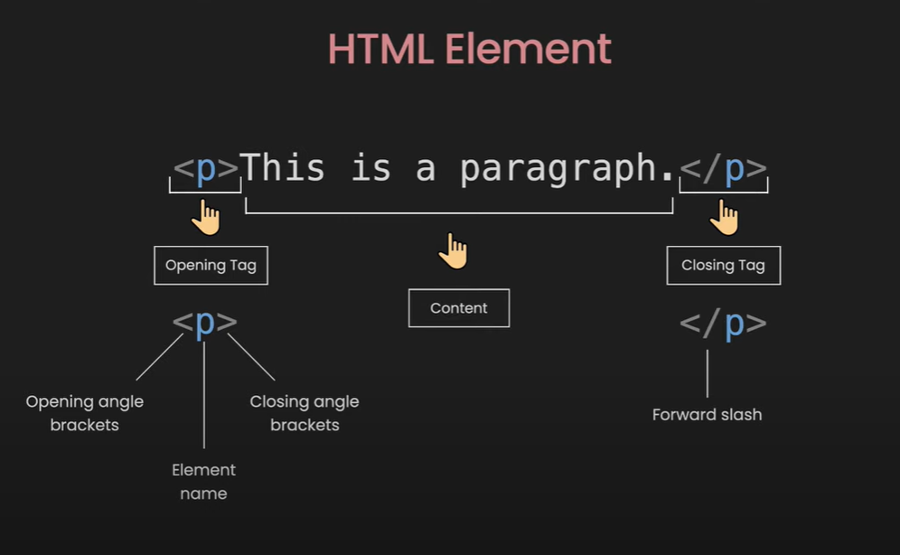

# HTML - Hypertext Markup Language

**What is HTML?**
- HTML stands for Hyper Text Markup Language
- HTML is the standard markup language for creating Web pages
- HTML describes the structure of a Web page
- HTML consists of a series of elements
- HTML elements tell the browser how to display the content
- HTML elements label pieces of content such as "this is a heading", "this is a     paragraph", "this is a link", etc.

## HTML page

```
<!DOCTYPE html>
<html>
<head>
<title>Page Title</title>
</head>
<body>

<h1>This is a Heading</h1>
<p>This is a paragraph.</p>
<ul>
<li>One</li>
<li>Two</li>
<li>Three</li>
</ul>

<ul>
<ol>One</ol>
<ol>Two</ol>
<ol>Three</ol>
</ul>


<a href="link">Home</a>

<hr />

<br />


</body>
</html>

```


## Empty Element
Insert or Embed something in the document
`<input>, , <br>, <hr>, <embed>, <meta>, <link>`

## Nesting
HTML elements can be nested

```
    <div class="list">
    <h2>My List: </h2>
    <ul>
        <li>Apple</li>
        <li>Mango</li>
        <li>Banana</li>
    </ul>
    </div>

```

## Attributes

Attributes contain extra information about the element that won't appear in the content

`  `